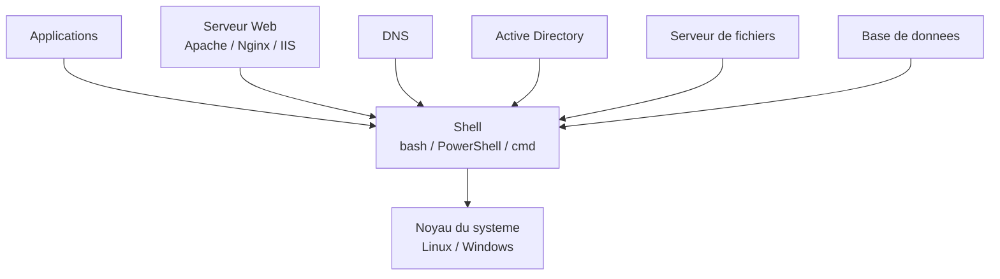

# Programmation de systèmes d’exploitation par scripts

## 1. Introduction

Cette leçon porte sur la **gestion et l’administration des systèmes d’exploitation à l’aide de scripts**. Il ne s’agit pas de programmer un système d’exploitation lui‑même, mais d’**automatiser des tâches d’administration**, de surveillance et de maintenance en utilisant des langages de script.

La programmation par scripts permet :

* d’automatiser des tâches répétitives
* de réduire les erreurs humaines
* d’assurer la cohérence des configurations
* de gagner du temps en administration système

---

## 2. Rôle des scripts en administration système

Un script est un programme interprété qui exécute une suite de commandes.

Les scripts sont utilisés pour :

* gérer les utilisateurs et les groupes
* surveiller l’état du système
* automatiser les sauvegardes
* déployer des logiciels
* analyser des journaux (logs)

Exemples courants :

* scripts Bash sous Linux/UNIX
* scripts PowerShell sous Windows

---

## 3. Environnements et outils

### 3.1 Linux / UNIX

* Shells : bash, sh, zsh
* Outils système : ps, top, grep, awk, sed, systemctl
* Planification : cron

### 3.2 Windows

* PowerShell
* Cmdlets système (Get‑Process, Get‑Service, Get‑EventLog)
* Planification : Task Scheduler

---

## 4. Bases de la programmation par scripts

### 4.1 Structure d’un script

* Shebang (#!/bin/bash)
* Commentaires
* Variables
* Conditions (if / case)
* Boucles (for / while)
* Fonctions

### 4.2 Gestion des erreurs

* Codes de retour
* Tests conditionnels
* Journalisation

---

## 5. Gestion des utilisateurs et des permissions

Tâches automatisables :

* création et suppression d’utilisateurs
* gestion des groupes
* attribution des permissions

Exemples de commandes :

* Linux : useradd, userdel, chmod, chown
* Windows : New‑LocalUser, Add‑LocalGroupMember

---

## 6. Gestion des processus et services

Objectifs :

* surveiller les processus
* démarrer/arrêter des services
* détecter les anomalies

Outils courants :

* Linux : ps, top, kill, systemctl
* Windows : Get‑Process, Stop‑Process, Get‑Service

---

## 7. Gestion des fichiers et sauvegardes

Fonctionnalités clés :

* création et suppression de fichiers
* archivage
* sauvegarde automatisée

Outils :

* Linux : cp, mv, tar, rsync
* Windows : Copy‑Item, Compress‑Archive

---

## 8. Surveillance et journaux système

Les scripts permettent de :

* analyser les logs
* surveiller l’espace disque
* vérifier l’utilisation CPU et mémoire

Exemples :

* df, du, free
* Get‑EventLog, Get‑WinEvent

---

## 9. Automatisation planifiée

### 9.1 Linux – cron

* Exécution périodique de scripts
* Maintenance automatisée

### 9.2 Windows – Task Scheduler

* Lancement conditionnel ou planifié
* Scripts PowerShell automatisés

---

## 10. Sécurité et bonnes pratiques

Bonnes pratiques :

* principe du moindre privilège
* validation des entrées
* journalisation des actions
* protection des scripts (permissions)

Risques à éviter :

* scripts exécutés en root inutilement
* mots de passe en clair

---

## 11. Cas pratiques pédagogiques

Exemples d’exercices :

* script de création automatique d’utilisateurs
* script de sauvegarde quotidienne
* script de surveillance des services
* génération de rapports système

---

## 12. Conclusion

La programmation par scripts est une compétence essentielle en administration des systèmes d’exploitation. Elle permet de transformer des tâches manuelles en processus fiables, reproductibles et efficaces.

👉 Elle est au cœur des métiers :

* administrateur système
* DevOps
* ingénieur cloud
* technicien en infrastructures

