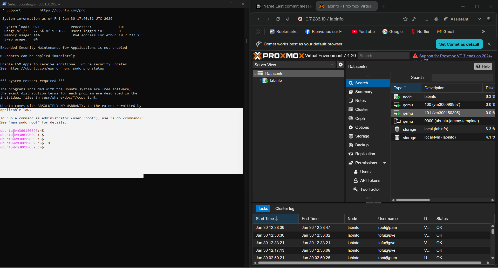

## VM Proxmox créée avec OpenTofu pour le cours INF1102.

---

## 1. Commandes utilisées 

```powershell
tofu init
tofu plan
tofu apply
```
## 2. Résumé de l’état OpenTofu
```powershell

json
{
  "type": "proxmox_vm_qemu",
  "name": "vm300150395",
  "ipconfig0": "ip=10.7.237.233/23,gw=10.7.237.1"
}
```
Cet extrait JSON montre que la VM vm300150395 a bien été créée sur Proxmox avec l’adresse IP 10.7.237.233/23 et la passerelle 10.7.237.1.

## 4. Contenu de tfvars
```powershell

pm_vm_name      = "vm300150395"
pm_ipconfig0    = "ip=10.7.237.233/23,gw=10.7.237.1"
pm_nameserver   = "10.7.237.3"
pm_url          = "https://10.7.236.19:8006/api2/json"
pm_token_id     = "tofu@pve!opentofu"
pm_token_secret = "f2097a3c-f9f0-4558-9a43-5cd0ae718abe"

```

## 4. Capture d’écran de la VM

## Capture d’écran de ma VM vm300150395

Cette image est la capture de l’accès à ma machine virtuelle vm300150395 créée automatiquement avec OpenTofu sur Proxmox.

</img>


