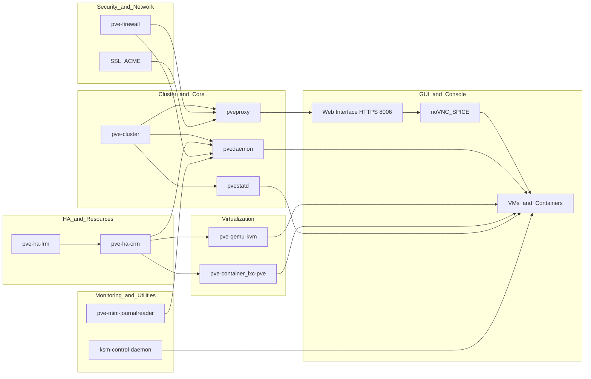
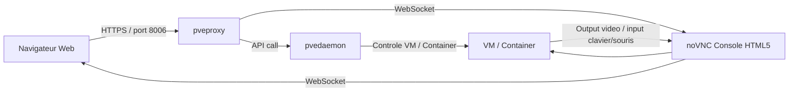

# Services Proxmox

La liste complète des services principaux de **Proxmox VE** que tu peux trouver sur un serveur PVE 7.x. Tu peux les lister avec :

```bash
systemctl list-units --type=service | grep pve
```

---

## 🔹 Services principaux

| Service                     | Description                                                |
| --------------------------- | ---------------------------------------------------------- |
| **pve-cluster**             | Gestion du cluster et configuration centralisée `/etc/pve` |
| **pvedaemon**               | API backend pour la GUI et les scripts                     |
| **pveproxy**                | Proxy HTTPS pour l’interface web (port 8006)               |
| **pvestatd**                | Collecte des statistiques des VMs et containers            |
| **pve-firewall**            | Firewall intégré à Proxmox                                 |
| **pve-ha-lrm**              | Local Resource Manager pour le HA                          |
| **pve-ha-crm**              | Cluster Resource Manager pour le HA                        |
| **pve-qemu-kvm**            | Service pour lancer les VMs QEMU/KVM                       |
| **pve-container / lxc-pve** | Gestion des containers LXC                                 |
| **pve-xtermjs**             | Console web pour VMs/containers (noVNC/SPICE)              |
| **proxmox-backup-client**   | Client de backup intégré (si utilisé)                      |
| **proxmox-mail-forward**    | Forwarding des notifications par mail                      |

---

## 🔹 Services secondaires / utilitaires

| Service                              | Description                                            |
| ------------------------------------ | ------------------------------------------------------ |
| **corosync**                         | Gestion du cluster (quorum et communication)           |
| **ksm-control-daemon**               | Deduplication mémoire KSM pour VMs                     |
| **spiceproxy / novnc-pve**           | Proxy pour consoles SPICE / VNC                        |
| **pve-firmware / pve-edk2-firmware** | Gestion du firmware des VM UEFI                        |
| **libproxmox-acme-perl**             | Gestion automatique des certificats ACME/Let's Encrypt |
| **pve-mini-journalreader**           | Journal simplifié pour Proxmox                         |
| **pve-kernel-helper**                | Scripts utilitaires pour kernels PVE                   |
| **swtpm**                            | TPM software pour VM si utilisé                        |
| **vncterm / spiceterm**              | Console texte pour VMs (VNC/SPICE)                     |

---

💡 **Astuce pratique** pour voir **tous les services actifs Proxmox** :

```bash
systemctl list-units --type=service | grep -E 'pve|proxmox|corosync|ksm|novnc|spice'
```
<details>

```lua
  ksmtuned.service                   loaded active running Kernel Samepage Merging (KSM) Tuning Daemon
  pve-cluster.service                loaded active running The Proxmox VE cluster filesystem
  pve-firewall.service               loaded active running Proxmox VE firewall
  pve-guests.service                 loaded active exited  PVE guests
  pve-ha-crm.service                 loaded active running PVE Cluster HA Resource Manager Daemon
  pve-ha-lrm.service                 loaded active running PVE Local HA Resource Manager Daemon
  pve-lxc-syscalld.service           loaded active running Proxmox VE LXC Syscall Daemon
  pvebanner.service                  loaded active exited  Proxmox VE Login Banner
  pvedaemon.service                  loaded active running PVE API Daemon
  pvefw-logger.service               loaded active running Proxmox VE firewall logger
  pvenetcommit.service               loaded active exited  Commit Proxmox VE network changes
  pveproxy.service                   loaded active running PVE API Proxy Server
  pvescheduler.service               loaded active running Proxmox VE scheduler
  pvestatd.service                   loaded active running PVE Status Daemon
  spiceproxy.service                 loaded active running PVE SPICE Proxy Server
```
  
</details>

Tu verras exactement ce qui tourne et ce qui est activé au démarrage.

## Graphe



### 👺 noVNC


